Useless Billing Prevention
Hands-on lab  
October 2021

<br />

**Contents**

## **1. 仮想マシン停止の自動化**

```
本手順では、仮想マシンを自動停止する手順を実行します。仮想マシンが起動していることを確認してから、以下の手順を進めてください。
```

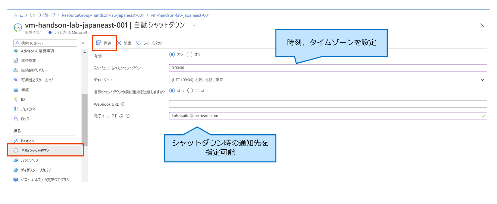

- 作成した仮想マシンを選択

- **自動シャットダウン**を選択し、以下の項目を入力

    - スケジュールされたシャットダウン: `0:00:00`
    - タイムゾーン: `(UTC+09:00 大阪、札幌、東京)`
    - 自動シャットダウンの前に通知を送信しますか?: `はい`
    - 電子メールアドレス: 通知を送信したいメールアドレスを入力


- **保存**をクリック

## **2. Azure Automation を用いた仮想マシン起動・停止の自動化**

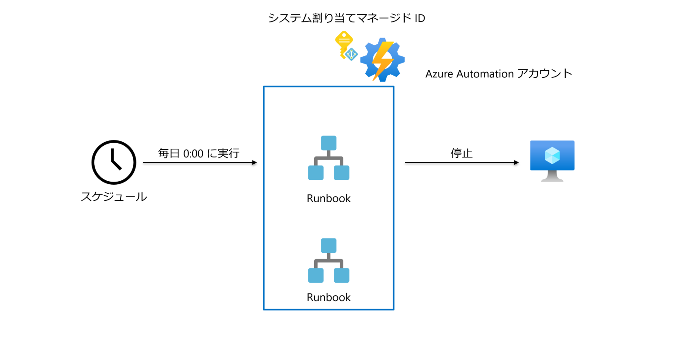

### **2-1. カスタム Runbook を作成**

```
本手順では、PowerShell によるスクリプトを作成し、仮想マシンの起動・停止を自動化するスクリプトを実行します。ハンズオン内では、仮想マシンを自動停止するスクリプトを使用します
```

- 作成した Automation アカウントを選択

- **Runbook** を選択し、以下の項目を入力

    - 名前: `StopVMDaily`
    - Runbook の種類: `PowerShell`
    - 説明: `仮想マシンを日次で停止するための Runbook。`


- `./scripts/StopVMDaily.ps1` のスクリプトをコピー & ペーストし、**保存**をクリック


- **公開**をクリック

- **スケジュールの追加**をクリック


- **スケジュールを Runbook にリンクします**をクリック


- **スケジュールの追加**をクリック


- 以下の項目を入力し、**作成**をクリック

    - 名前: `every-midnight`
    - 説明: `毎晩 0:00`
    - 開始時: `任意の日付 0:00`
    - タイムゾーン: `Japan - Japan Time`
    - 繰り返し: `定期的`
    - 間隔: `1 日`
    - 有効期限の設定: `いいえ`


- **OK** をクリック


- **開始**をクリック（テスト実行）


- ジョブが**失敗**していることを確認


- Automation アカウントに対してシステム割り当てマネージド ID を有効化


- **ロールの割り当て**をクリック


- <b>ロールの割り当ての追加(プレビュー)</b>をクリック


- 以下の項目を入力し、**保存**をクリック

    - スコープ: `サブスクリプション`
    - サブスクリプション: ワークショップで使用するサブスクリプション
    - 役割: `仮想マシン共同作成者`

- **開始**をクリック（再びテスト実行）


- **出力**タブでログを確認し、`Status` が `Succeeded` になっていることを確認

```log
OperationId : 9c42c7b0-d69f-4bed-b564-5109cbad0e8e
Status      : Succeeded
StartTime   : 10/7/2021 6:49:02 AM
EndTime     : 10/7/2021 6:49:48 AM
Error       : 
Name        : 
```


### **2-2. Runbook ギャラリーからスクリプトをインポート**

```
Azure Automation で独自の Runbook およびモジュールを作成するのではなく、マイクロソフトやコミュニティによって既に作成されているシナリオにアクセスできます。
本手順では、ギャラリーを参照し、 Runbook のインポートのみを行います。
```

- **ギャラリーを参照**をクリック


- **Stop-Start-AzureVM (Scheduled VM Shutdown/Startup)** をクリック


- **インポート**をクリック


- 以下の項目を入力し、**OK** をクリック

    - 名前: `Stop-Start-AzureVM`
    - Runbook の種類: `PowerShell ワークフロー`（変更不可）
    - 説明: 既定値


## **3. Azure Functions を用いた仮想マシン起動・停止の自動化**

```
本手順では、仮想マシンを自動起動するスクリプトを使用します。仮想マシンが停止していることを確認してから以下の手順を進めてください。
```

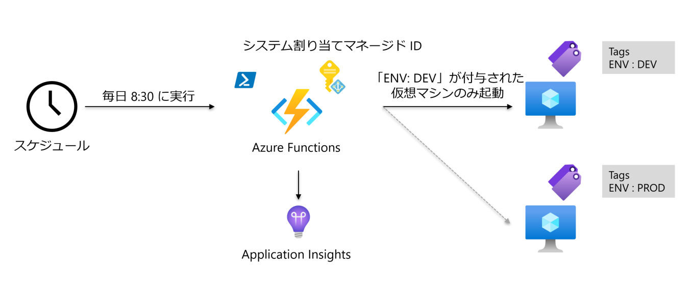

-. システム割り当てマネージド ID を有効化し、**保存**をクリック


- **ロールの割り当て**をクリック


- <b>ロールの割り当ての追加(プレビュー)</b>をクリック


- 以下の項目を入力し、**保存**をクリック

    - スコープ: `サブスクリプション`
    - サブスクリプション: ワークショップで使用するサブスクリプション
    - 役割: `仮想マシン共同作成者`

- 以下の環境変数を追加し、**保存**をクリック

    - resourceGroup: `<起動対象の仮想マシンが存在するリソースグループ名>`
    - WEBSITE_TIME_ZONE: 'Asia/Tokyo'

    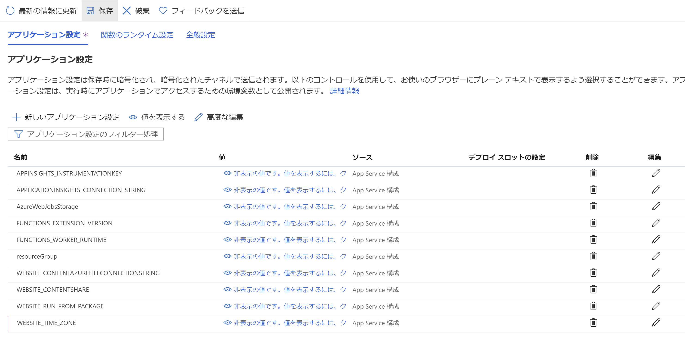

- ローカル PC にて Visual Studio Code を起動


- Azure Functions 拡張機能から、関数を作成

    - **Create Function** をクリックし、**Timer Trigger** を選択

    

    - **StartVMs** を入力

    

    - スケジュールとして `0 30 8 * * *` を入力

    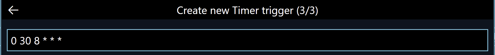

- `host.json` の `managedDependency` が有効化されていることを確認

```json
・・・
"managedDependency": {
    "enabled": true
  },
・・・
```

- `host.json` の末尾に以下を追記

```json
・・・
  "functionTimeout": "00:10:00"
```

- `requirements.psd1` の以下をアンコメント

```ps1
    'Az' = '6.*'
```

- `StartVMs/run.ps1` を `./functions/StartVMs/run.ps1` の内容に書き換え

- Azure Functions 拡張機能から、関数をデプロイ

    - **Deploy to Function App** をクリック

    

    - Azure Functions が存在するサブスクリプションを選択

    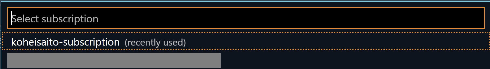

    - `function-handson-lab-japaneast-001` を選択

    

    - `Deploy` を選択

    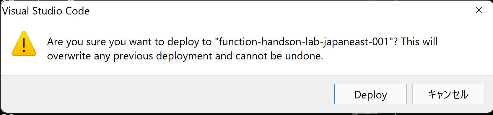

- Azure Portal から **StartVMs** を選択


- **コードとテスト**タブから**実行**をクリック


- 出力されるログにて、`StatusCode: Accepted` となっていることを確認

```log
2021-10-10T07:49:47.170 [Information] OUTPUT: RequestId                            IsSuccessStatusCode StatusCode ReasonPhrase
2021-10-10T07:49:47.170 [Information] OUTPUT: ---------                            ------------------- ---------- ------------
2021-10-10T07:49:47.172 [Information] OUTPUT: 7a40a0a0-86a1-47ec-8690-0ace2616a171                True   Accepted Accepted
2021-10-10T07:49:47.172 [Information] OUTPUT:
2021-10-10T07:49:47.220 [Information] Executed 'Functions.StartVMs' (Succeeded, Id=edc34ae7-90ad-4c14-8f3a-b960aef7671a, Duration=31220ms)
```

- 仮想マシンが起動していることを確認


- タグ `ENV: PROD` を付与した仮想マシンは起動していないことを確認


## **4. コストのアラートによる想定以上の課金防止**

```
本手順では、コストのアラートを設定し、設定した請求額に達すると通知を飛ばす仕組みを構成します。
手順内では、メールによる設定のみを構成していますが、Logic Apps と組み合わせることで、Teams や Slack へ通知を送信することも可能です。
```

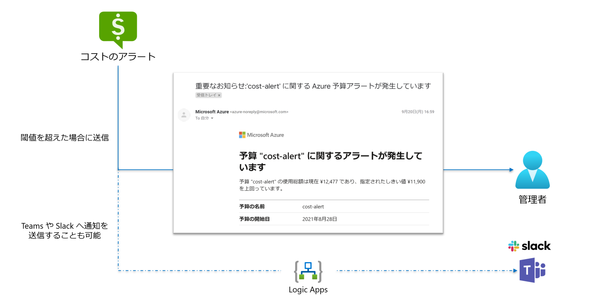

- **コストの管理と請求**を検索

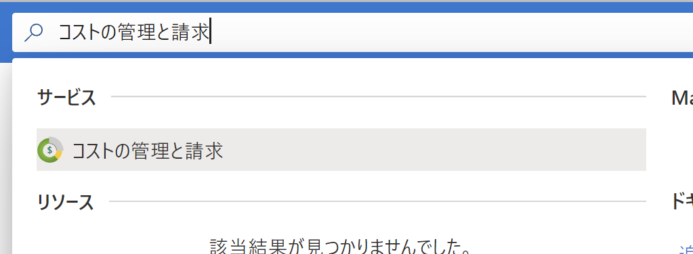

- **概要**ページにて**コスト管理**をクリック


- **コストのアラート**をクリック

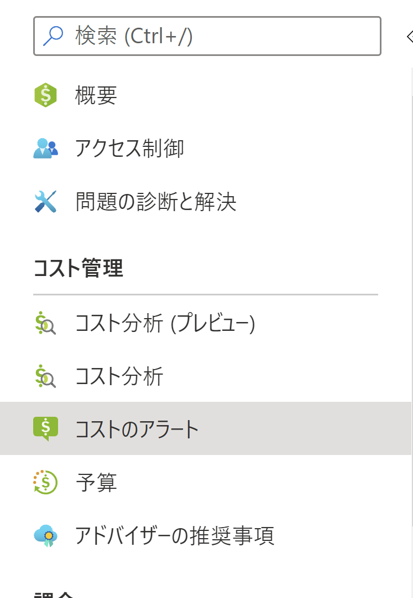

- **追加**をクリック

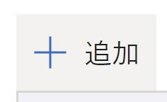

- **予算の作成**タブにて以下の項目を入力し、**次へ**をクリック

    - 予算のスコープ
        
        - スコープ: 任意のサブスクリプション
        - フィルター: なし

    - 予算の詳細
    
        - 名前: `Cost-Alert`
        - リセット期間: `課金月`
        - 作成日: 任意の値
        - 有効期限: 任意の値

    - 予算額

        - 金額: `10000`

    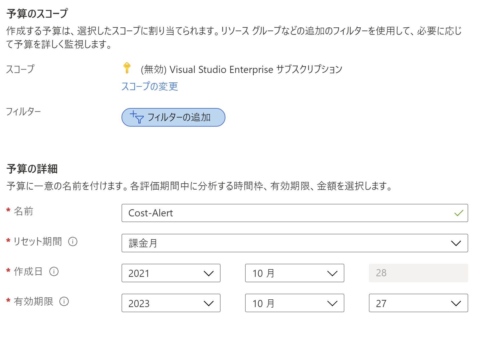

    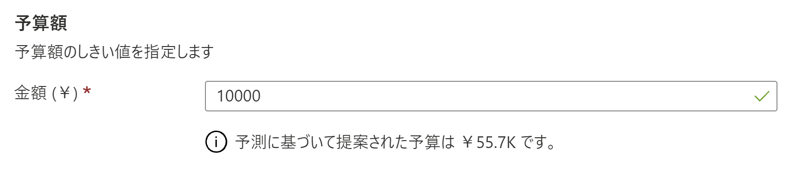


- **通知の設定**タブにて以下の項目を入力し、**作成**をクリック

    - 警告条件

        - 種類: `予測`
        - 予算の割合: `70`
        - アクショングループ: `なし`

    - アラートの受信者（メール）

        - アラートの受信者: 通知先のメールアドレス

    - 言語の設定

        - 言語: `既定`

    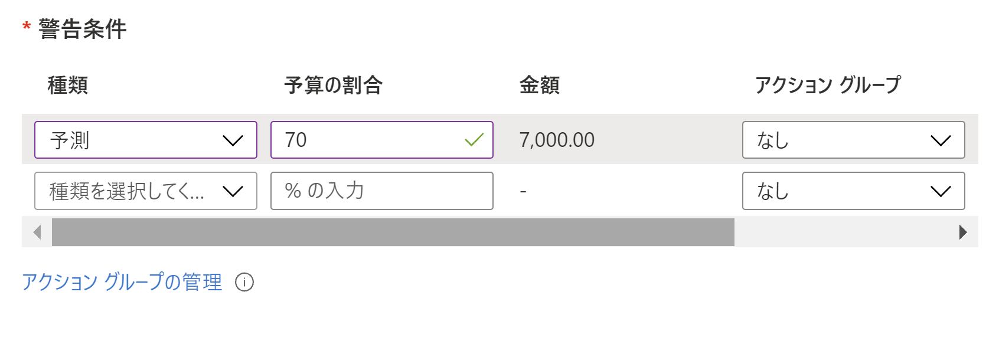
    
    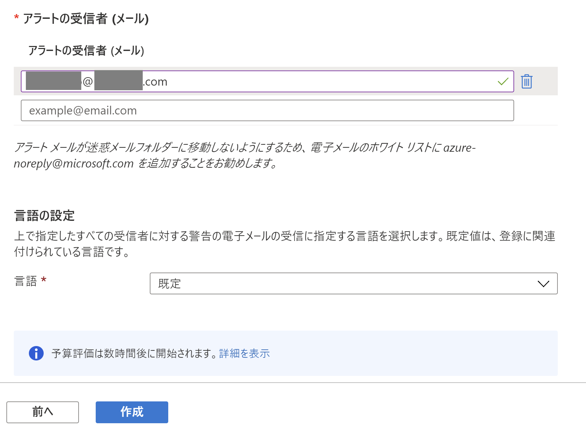

```
Azure リソースに対する請求額が閾値を超えると、以下のようなメールが送信されます。
```

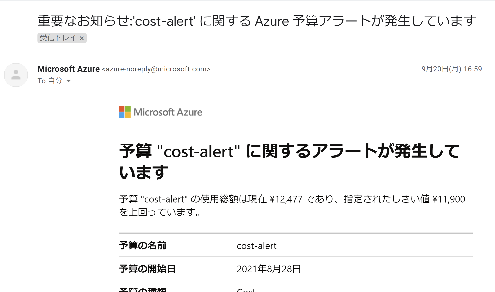
