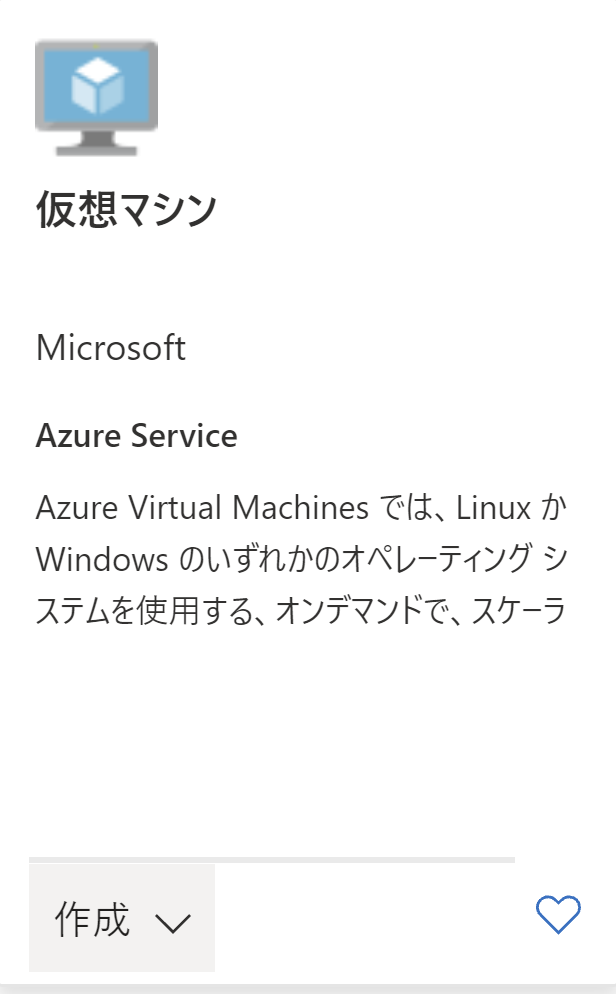
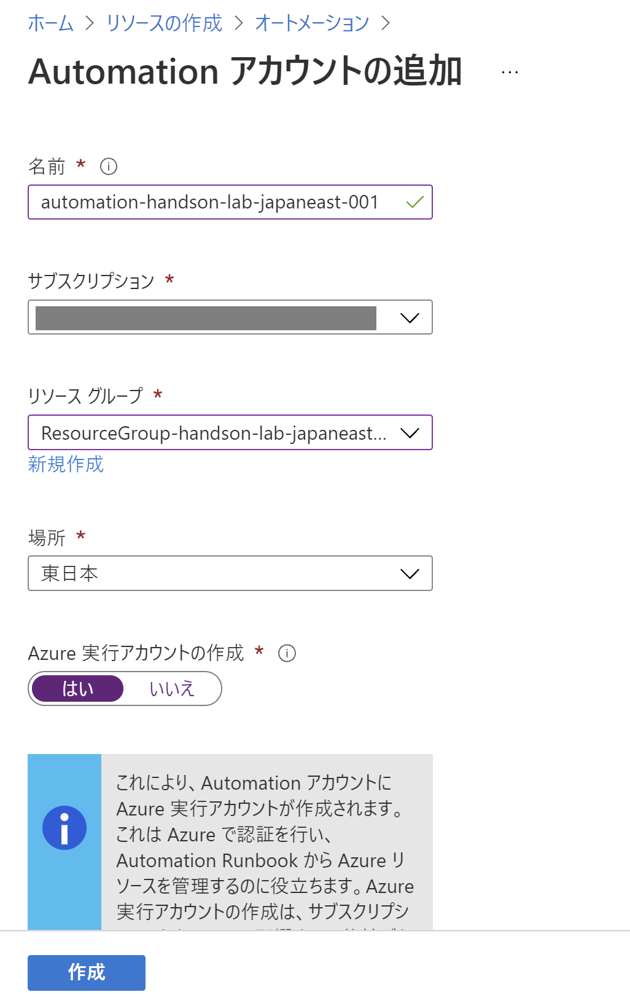

Useless Billing Prevention
Hands-on lab  
October 2021

 

**Contents**

- Useless Billing Prevention manual resource setup guide

    - Task 0 : リソースグループの作成
    - Task 1 : 仮想マシンの作成
    - Task 2 : Azure Automation アカウントの作成
    - Task 3 : Azure Functions の作成

## Manual Resource Setup

### Task 0 : リソースグループの作成

1. Web ブラウザーから **Azure ポータル** (<https://portal.azure.com>) を開く

2. **+リソースの作成**をクリック

3. 画面上部の検索ボックスに **Resource group** と入力し表示される候補から **Resouce Group** を選択

4. **作成**をクリック

5. **基本**タブで次を入力し**確認および作成**をクリック

- リソースグループ名: 任意 ( このサブスクリプションで一意 )
- リージョン: 任意 ( このワークショップで使用する地域 )

6. **確認および作成**タブで**作成**をクリックし新しいリソースグループを作成

### Task 1 : 仮想マシンの作成

#### Task 1-1 : 仮想ネットワークの作成

1. ホーム画面から**リソースの作成**をクリック

2. 検索ボックスに **Virtual Network** と入力し表示される候補から **Virtual Network** を選択

3. **作成**をクリック

4. **基本**タブで次の構成を設定し **IP アドレス**をクリック

- プロジェクトの詳細
    - サブスクリプション: ワークショップで使用するサブスクリプション
    - リソースグループ: 先の手順で作成したリソースグループ
- インスタンスの詳細
    - 名前: vnet-handson-lab-japaneast-001
    - リージョン: 東日本

5. **IP アドレス**タブで IP アドレス空間とサブネットを確認し**確認および作成**をクリック

> 本ワークショップでは以下の IP アドレス空間で作成

- **仮想ネットワーク**: 10.0.0.0/20
- **サブネット**: 10.0.0.0/27

6. **確認および作成**タブで**作成**をクリックし新しい仮想ネットワークを作成

#### Task 1-2 : パブリック IP の作成

1. ホーム画面から**リソースの作成**をクリック

2. 検索ボックスに **public ip address** と入力し表示される候補から **Public IP address** を選択

3. **作成**をクリック

4. 次の構成を設定し、**作成**をクリック

- IP バージョン: `IPv4`
- SKU: `Standard`
- レベル: `地域`

- IPv4 IP アドレスの構成
    - 名前: `PIP-handson-lab-japaneast-001`
    - IP アドレスの割り当て: `動的`
    - ルーティングの順位: `Microsoft ネットワーク`
    - アイドルタイムアウト（分）: `4`
    - DNS 名ラベル: 入力不要
    - サブスクリプション: ワークショップで使用するサブスクリプション
    - リソースグループ: 先の手順で作成したリソースグループ
    - 場所: `東日本`
    - 可用性ゾーン: `ゾーン冗長`

#### Task 1-3 : 仮想マシンの作成

1. ホーム画面から**リソースの作成**をクリック

2. 検索ボックスに **Virtual Machine** と入力し表示される候補から **Virtual Machine** を選択

3. **作成**をクリック

4. **基本**タブで次の構成を設定し **ディスク**をクリック

- プロジェクトの詳細
    - サブスクリプション: ワークショップで使用するサブスクリプション
    - リソースグループ: 先の手順で作成したリソースグループ
- インスタンスの詳細
    - 名前: `vm-handson-lab-japaneast-001`
    - リージョン: `東日本`
    - 可用性オプション: `可用性ゾーン`
    - 可用性ゾーン: `1`
    - イメージ: `Windows Server 2019 Datacenter - Gen 2`
    - サイズ: `Standard_B2ms`
- 管理者アカウント
    - ユーザー名: `userAdmin`
    - パスワード: `AdminPassword#123`
- 受信ポートの規則
    - パブリック受信ポート: `選択したポートを許可する`
    - 受信ポートを選択: `RDP (3389)`

5. **ディスク**タブで次の構成を設定し **ネットワーク**をクリック

- ディスクのオプション
    - OS ディスクの種類: `Standard SSD（ローカル冗長ストレージ）`
    - 暗号化の種類: `（既定）プラットフォーム マネージド キーを使用した保存時の暗号化`
    - Ultra Disk の互換性を有効にする: `オフ`

6. **ネットワーク**タブで次の構成を設定し **タグ**をクリック

- ネットワークインターフェース
    - 仮想ネットワーク: 先の手順で作成した仮想ネットワーク
    - サブネット: 先の手順で作成したサブネット
    - パブリック IP: 先の手順で作成したパブリック IP アドレス
    - NIC ネットワークセキュリティグループ: `Basic`
    - パブリック受信ポート: `選択したポートを許可する`
    - 受信ポートを選択: `RDP (3389)`
    - 高速ネットワーク: `オフ`

- 負荷分散
    - この仮想マシンを既存の負荷分散ソリューションの後ろに配置しますか?: `オフ`

6. **タグ**タブで以下のタグを入力し、**確認および作成**をクリック

- 名前: `ENV`
- 値: `DEV`
- リソース: `仮想マシン`

7. **確認および作成**タブで**作成**をクリックし新しい仮想マシンを作成

**同様の手順を繰り返し、以下のタグを付与した仮想マシンを作成する**

- 名前: `ENV`
- 値: `PROD`
- リソース: `仮想マシン`

### Task 2 : Azure Automation アカウントの作成

1. ホーム画面から**リソースの作成**をクリック

2. 検索ボックスに **Automation** と入力し表示される候補から **Automation** を選択

3. **作成**をクリック

4. 次の構成を設定し、**作成**をクリック

- 名前: `automation-handson-lab-japaneast-001`
- サブスクリプション: ワークショップで使用するサブスクリプション
- リソースグループ: 先の手順で作成したリソースグループ
- 場所: `東日本`
- Azure Automation 実行アカウントの作成: `はい

### Task 3 : 関数アプリの作成

1. ホーム画面から**リソースの作成**をクリック

2. 検索ボックスに **Function** と入力し表示される候補から **Function App** を選択

3. **作成**をクリック

4. **基本**タブで次の構成を設定し、**ホスティング**をクリック

- プロジェクトの詳細
    - サブスクリプション: ワークショップで使用するサブスクリプション
    - リソースグループ: 先の手順で作成したリソースグループ
- インスタンスの詳細
    - 関数アプリ名: `function-handson-lab-japaneast-001`
    - 公開: `コード`
    ランタイムスタック: `PowerShell Core`
    - バージョン: `7.0`
    - 地域: `Japan East`

5. **ホスティング**タブで次の構成を設定し、**監視**タブをクリック

- Storage
    
    - ストレージアカウント: 任意の名前

- オペレーティングシステム

    - オペレーティングシステム: `Windows`

- プラン

    - プランの種類: `消費量（サーバーレス）`

6. **監視**タブで次の構成を設定し、**確認および作成**をクリック

- Application Insights

    - Application Insights を有効にする: `はい`
    - Application Insights: `application-insights-handson-lab-japaneast-001`
    - 地域: `Japan East`

7. **確認および作成**タブで**作成**をクリックし、新しい関数アプリを作成

