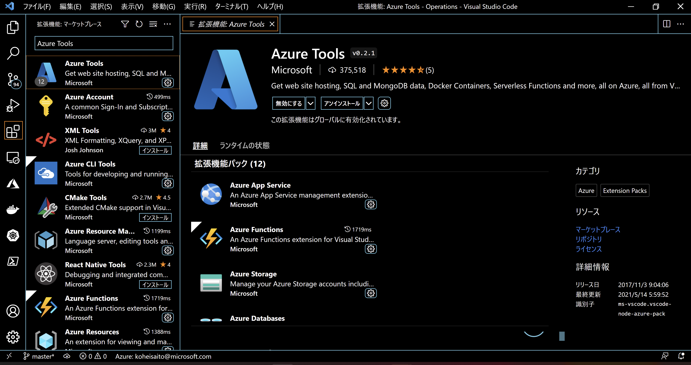

Useless Billing Prevention
Hands-on lab  
October 2021

 

**Contents**

1. 仮想マシン停止の自動化

    - 目標
        - Azure Portal 上で設定可能であることを確認する

2. Azure Automation を用いた仮想マシン起動・停止の自動化

    - 目標
        - Azure Automation の使用方法を確認する

3. Azure Functions を用いた仮想マシン起動・停止の自動化

    - 目標
        - Azure Functions の使用方法を確認する
        - タグによるリソースの管理方法を確認する（`ENV:DEV` タグを付与した仮想マシンのみ、スケジュールに沿って自動起動する関数を設定します）

**前提条件**

- Azure サブスクリプション
- Visual Studio Code（まだインストールされていない場合は[こちら](https://azure.microsoft.com/ja-jp/products/visual-studio-code/)からダウンロードし、インストール）

    - Azure Tools 拡張機能

    

## ハンズオンの進め方

以下の手順でハンズオンを進めてください。

### **1. リソース作成**

ハンズオンで使用する Azure リソースを作成します。

以下の**いずれか**の方式で、環境構築・リソース作成を行ってください。（※両方ともやっていただく内容は同じですので、どちらかの方式だけを実行いただくだけで構いません。）

- `Manual-Resource-Setup.md` の手順にしたがってリソースを作成する
- 以下のボタンを順番にクリックし、パラメータの値を埋めてリソースを作成する

    - リソースグループの作成

         
    - 仮想マシンの作成

         

    - Azure Automation アカウントの作成

         

    - Azure Functions の作成

         

### **2. ハンズオン内容の実施**

`HOL-step-by-step-useless-billing-prevention.md` に記載されている内容に従って、ハンズオンを順次進めてください。